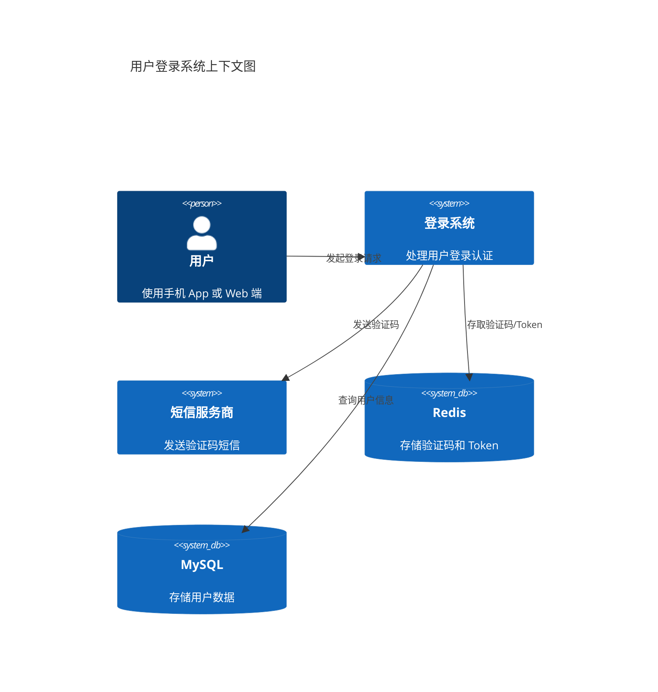
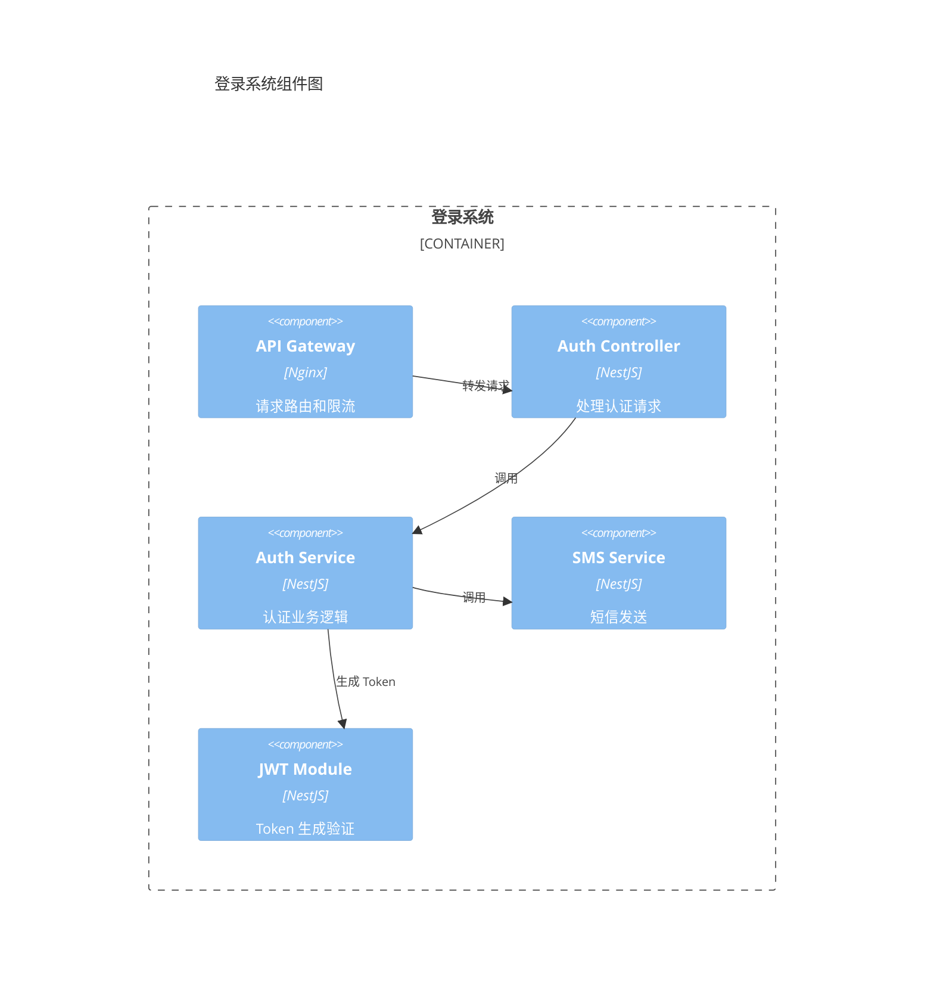

# 技术方案

## 需求概述

实现手机号 + 验证码登录功能，替代原有的账号密码登录。

## 架构设计

### 系统上下文图



### 组件设计



## 技术选型

| 组件 | 技术 | 理由 |
|------|------|------|
| 框架 | NestJS | 团队熟悉、类型安全、模块化 |
| 缓存 | Redis | 高性能、支持过期时间 |
| Token | JWT | 无状态、易扩展 |
| 短信 | 阿里云 SMS | 稳定、到达率高 |
| 限流 | Redis + Lua | 精确、高性能 |

## 数据库设计

### 用户表

```sql
CREATE TABLE users (
  id VARCHAR(36) PRIMARY KEY,
  phone VARCHAR(11) NOT NULL UNIQUE,
  nickname VARCHAR(50),
  avatar VARCHAR(255),
  created_at TIMESTAMP DEFAULT CURRENT_TIMESTAMP,
  updated_at TIMESTAMP DEFAULT CURRENT_TIMESTAMP ON UPDATE CURRENT_TIMESTAMP,
  deleted_at TIMESTAMP NULL,
  INDEX idx_phone (phone)
) ENGINE=InnoDB DEFAULT CHARSET=utf8mb4;
```

### 登录日志表

```sql
CREATE TABLE login_logs (
  id BIGINT AUTO_INCREMENT PRIMARY KEY,
  user_id VARCHAR(36) NOT NULL,
  phone VARCHAR(11) NOT NULL,
  ip VARCHAR(45) NOT NULL,
  user_agent VARCHAR(500),
  status TINYINT NOT NULL COMMENT '0:失败 1:成功',
  fail_reason VARCHAR(100),
  created_at TIMESTAMP DEFAULT CURRENT_TIMESTAMP,
  INDEX idx_user_id (user_id),
  INDEX idx_phone (phone),
  INDEX idx_created_at (created_at)
) ENGINE=InnoDB DEFAULT CHARSET=utf8mb4;
```

## API 设计

参考：[docs/api/auth.yaml](../api/auth.yaml)

### 端点列表

| 方法 | 路径 | 描述 | 认证 |
|------|------|------|------|
| POST | /api/v1/auth/send-code | 发送验证码 | 否 |
| POST | /api/v1/auth/login | 登录 | 否 |
| POST | /api/v1/auth/logout | 登出 | 是 |

### 响应格式

统一响应格式：

```json
{
  "code": 0,
  "message": "success",
  "data": {}
}
```

错误响应：

```json
{
  "code": 400,
  "message": "参数错误",
  "details": {
    "field": "phone",
    "reason": "格式不正确"
  }
}
```

## 实现计划

### 任务拆分

| 任务 | 负责人 | 估时 (天) | 依赖 |
|------|--------|-----------|------|
| Redis 配置 | @backend1 | 0.5 | 无 |
| 发送验证码接口 | @backend1 | 1 | Redis 配置 |
| 登录接口 | @backend2 | 1 | 发送验证码 |
| 登出接口 | @backend2 | 0.5 | 登录接口 |
| 单元测试 | @backend1 | 1 | 所有接口 |
| 联调测试 | 全体 | 1 | 单元测试完成 |

总计：4 天

## 风险评估

| 风险 | 概率 | 影响 | 应对措施 |
|------|------|------|----------|
| 短信服务商不稳定 | 中 | 高 | 接入备用服务商 |
| 验证码被刷 | 高 | 中 | 多层次限流（IP、手机号） |
| Token 泄露 | 低 | 高 | HTTPS、短有效期、刷新机制 |
| 数据库性能瓶颈 | 低 | 中 | 读写分离、缓存用户信息 |

## 回滚方案

### 回滚条件

- 登录成功率 < 95%
- P95 延迟 > 1s
- 严重 Bug 影响核心流程

### 回滚步骤

1. 切回旧版本代码
2. 恢复数据库（如有变更）
3. 清理 Redis 缓存
4. 验证回滚后功能

### 回滚时间

预计 30 分钟内完成

## 监控告警

### 核心指标

| 指标 | 阈值 | 告警级别 |
|------|------|----------|
| 登录成功率 | < 95% | P0 |
| 验证码发送成功率 | < 90% | P0 |
| P95 延迟 | > 500ms | P1 |
| 错误日志数 | > 100/分钟 | P1 |

### 监控面板

- 登录成功率趋势
- 验证码发送量/成功率
- 接口延迟分布
- 错误日志统计

## 附录

### 验证码生成规则

- 6 位数字
- 使用 crypto.randomInt
- 不使用易混淆数字（0、1）

### Token 配置

- 算法：HS256
- 有效期：24 小时
- 刷新：支持 Refresh Token

### 限流规则

| 维度 | 限制 | 时间窗口 |
|------|------|----------|
| 发送验证码（单 IP） | 10 次 | 1 小时 |
| 发送验证码（单手机） | 10 次 | 1 天 |
| 登录尝试（单手机） | 5 次 | 1 小时 |
