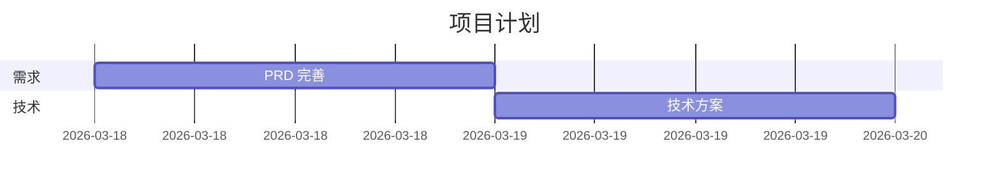

# 研发过程"需求流转"深度分析报告

**更新日期**: 2026-03-18  
**分析对象**: AI 协作团队 Skills 需求流转链路（含 frontend-design）

---

## 一、完整流转链路图

```
┌─────────────────────────────────────────────────────────────────────────┐
│                        需求流转全景图                                     │
└─────────────────────────────────────────────────────────────────────────┘

                原始需求
                   ↓
          [Product Manager]
               ↓ PRD
        ┌──────┴──────┐
        ↓             ↓
[Project Manager]  [Tech Lead]
   ↓ 项目计划      ↓ 技术方案 + API 契约
        └──────┬──────┘
               ↓
        ┌──────┴──────┐
        ↓             ↓
   [Backend]   [Frontend-Design]
   后端代码        UI/UX 设计
   （并行）        （并行）
        ↓             ↓
        └──────┬──────┘
               ↓
       [Frontend]
           前端代码
               ↓
        ┌──────┴──────┐
        ↓             ↓
   单元测试      [QA] → 测试用例 + 测试报告
                        ↓
                [Code Review] → 审查报告 → 上线
```

### 流转阶段说明

| 阶段 | Skill | 输入 | 输出 | 输出文件 | 依赖 |
|------|-------|------|------|---------|------|
| 1 | Product Manager | 原始需求 | PRD 文档 | `docs/prd/*.md` | 无 |
| 2 | Project Manager | PRD | 项目计划 | `docs/project/*.md` | Product Manager |
| 2 | Tech Lead | PRD | 技术方案 + API 契约 | `docs/tech/*.md` + `docs/api/*.yaml` | Product Manager |
| 3 | Backend | API 契约 + 技术方案 | 后端代码 | `src/**/*.ts` | Tech Lead |
| 3 | Frontend-Design | PRD + API | 设计文档 + 组件代码 | `designs/*/{design.md,components/,review.md}` | Tech Lead |
| 4 | Frontend | 设计稿 + 组件代码 + API | 前端代码 | `src/**/*.tsx` | Backend + Frontend-Design |
| 5 | QA | PRD + API + 源代码 | 测试用例 + 测试报告 | `tests/**/*.test.ts` | Backend + Frontend-Design |
| 6 | Code Review | 源代码 + 技术方案 | 审查报告 | Code Review 报告 | QA |

**关键说明**:
- **阶段 2 并行**: Project Manager 和 Tech Lead 并行工作，都依赖 Product Manager 的 PRD
- **阶段 3 并行**: Backend 和 Frontend-Design 并行工作，都依赖 Tech Lead 的输出
- **阶段 4 汇合**: Frontend 需要等待 Backend 和 Frontend-Design 都完成后才能开始
- **Project Manager** → 输出项目计划（排期、资源分配、风险评估）
- **Tech Lead** → 输出技术方案和 API 契约（架构设计、技术选型）
- **开发团队** → 需要技术方案和项目计划都完成后才能开始

---

## 二、各阶段流转详细分析

### 阶段 1: Product Manager → Project Manager / Tech Lead

**Product Manager** 完成 PRD 分析后，流程分为两条并行线路：
- **Project Manager** → 项目计划（排期、资源分配）
- **Tech Lead** → 技术方案（架构设计、API 契约）

两者**并行工作**，互不依赖。

---

### 阶段 2 并行：Project Manager / Tech Lead

**Product Manager** 完成 PRD 分析后，流程分为两条并行线路：
- **Project Manager** → 项目计划（排期、资源分配、风险评估）
- **Tech Lead** → 技术方案（架构设计、API 契约）

两者**并行工作**，互不依赖，都只需要 PRD 作为输入。

---

### 阶段 3 并行：Backend / Frontend-Design

**Tech Lead** 完成技术方案和 API 契约后，流程再次分为两条并行线路：
- **Backend** → 后端代码实现（依赖 API 契约 + 技术方案）
- **Frontend-Design** → UI/UX 设计 + 组件代码（依赖 PRD + API 契约）

两者**并行工作**，互不依赖：
- Backend 不需要等 Frontend-Design 完成
- Frontend-Design 不需要等 Backend 完成
- 两者都只需要 Tech Lead 的输出即可开始

---

### 阶段 4 汇合：Frontend

**Frontend** 需要等待以下两者都完成后才能开始：
- **Backend** 完成（API 实现）
- **Frontend-Design** 完成（设计稿 + 组件代码）

**Frontend** 基于以下内容进行业务逻辑开发：
- 设计稿（来自 Frontend-Design）
- 可复用组件代码（来自 Frontend-Design）
- API 接口（来自 Backend）

---

### 阶段 5: QA → Code Review

#### 流转验证

| 项目 | 内容 |
|------|------|
| **输出 Skill** | `project-manager` |
| **输出文件** | `docs/project/{feature-name}-plan.md` |
| **输出内容** | 项目计划（任务拆解、排期、风险评估、资源分配） |
| **输入 Skill** | `backend-typescript` / `backend-springboot` / `frontend` / `qa-engineer` |
| **输入要求** | `@docs/collaboration/project/{feature-name}-plan.md` |
| **匹配度** | ✅ **完全匹配** |

#### 代码验证

**Project Manager 输出规范**:
```markdown
## 输出规范

- 始终使用 Markdown 格式
- 包含 YAML frontmatter
- 排期用甘特图（Mermaid）或表格
- 风险用矩阵展示
- 任务拆解到 0.5 天粒度
```

**开发团队输入要求**:
```markdown
## 项目计划
@docs/collaboration/project/{feature-name}-plan.md
```

#### 结论

✅ **完全匹配** - Project Manager 输出的项目计划为所有开发阶段提供排期和任务分配

**项目计划示例结构**:
```markdown
---
id: PROJ-2024-001
title: 手机号登录功能项目计划
project-manager: @team
status: draft
---

# 项目概述

## 团队资源
| 角色 | 人数 | 可用时间 |
|------|------|----------|
| 后端 | 2 | 100% |
| 前端 | 2 | 100% |
| 测试 | 1 | 100% |

## 任务拆解
| 任务 | 负责人 | 估时 | 依赖 |
|------|--------|------|------|
| PRD 完善 | @team | 1 天 | 无 |
| 技术方案 | @team | 1 天 | PRD |
| 后端开发 | @backend | 2 天 | 技术方案 |
| 前端设计 | @designer | 1 天 | PRD |
| 前端开发 | @frontend | 2 天 | 设计稿 |
| 测试 | @qa | 1 天 | 开发完成 |

## 甘特图

```

---

### 阶段 1: Product Manager → Tech Lead / Project Manager

#### 流转验证

| 项目 | 内容 |
|------|------|
| **输出 Skill** | `product-manager` |
| **输出文件** | `docs/prd/{feature-name}.md` |
| **输出内容** | PRD 文档（用户故事、功能需求、验收条件、数据埋点） |
| **输入 Skill** | `tech-lead` |
| **输入要求** | `@docs/collaboration/prd/{feature-name}.md` |
| **匹配度** | ✅ **完全匹配** |

#### 代码验证

**Product Manager 输出规范**（SKILL.md line 17-21）:
```markdown
## 输出规范

- 始终使用 Markdown 格式
- 包含 YAML frontmatter（id, title, product-manager, create-date, priority, status）
- 用户故事用表格呈现
- 验收条件用复选框列表
- 业务目标尽量量化
```

**Tech Lead 输入要求**（SKILL.md line 33-35）:
```markdown
## PRD 文档

@docs/collaboration/prd/{feature-name}.md
```

#### 结论

✅ **完全匹配** - Product 输出的 PRD 文档格式完全符合 Tech Lead 的输入要求

**PRD 文档示例结构**:
```markdown
---
id: PRD-2024-001
title: 手机号登录功能
product-manager: @team
priority: P0
status: draft
---

# 需求背景
# 用户故事
# 功能需求
# 验收条件
# 数据埋点
```

---

### 阶段 2: Tech Lead → Backend/Frontend

#### 流转验证

| 项目 | 内容 |
|------|------|
| **输出 Skill** | `tech-lead` |
| **输出文件** | `docs/tech/{feature-name}.md` + `docs/api/{feature-name}.yaml` |
| **输出内容** | 技术方案（架构图、技术选型）+ API 契约（OpenAPI 3.0） |
| **输入 Skill** | `backend-typescript` / `frontend` |
| **输入要求** | `@docs/collaboration/api/{feature-name}.yaml` + `@docs/collaboration/tech/{feature-name}.md` |
| **匹配度** | ✅ **完全匹配** |

#### 代码验证

**Tech Lead 输出规范**（SKILL.md line 19-24）:
```markdown
## 输出规范

- 始终使用 Markdown 格式
- 包含 YAML frontmatter
- 架构图用 Mermaid（C4Context/C4Container/C4Component）
- 技术选型用对比表格（至少 3 个维度）
- API 使用 OpenAPI 3.0 YAML 格式
- 工作量评估到天，标注依赖和 buffer（10-20%）
```

**Backend 输入要求**（SKILL.md line 40-46）:
```markdown
## API 契约

@docs/collaboration/api/{feature-name}.yaml

## 技术方案

@docs/collaboration/tech/{feature-name}.md
```

**Frontend 输入要求**（SKILL.md line 46-48）:
```markdown
## API 契约

@docs/collaboration/api/{feature-name}.yaml
```

#### 结论

✅ **完全匹配** - Tech Lead 输出的 API 契约和技术方案完全符合后端/前端的输入要求

**API 契约示例结构**:
```yaml
openapi: 3.0.0
info:
  title: 用户认证 API
  version: 1.0.0
paths:
  /api/v1/auth/login:
    post:
      summary: 用户登录
      operationId: loginUser
      tags: [Auth]
      requestBody:
        required: true
        content:
          application/json:
            schema:
              $ref: '#/components/schemas/LoginRequest'
```

---

### 阶段 3: Backend/Frontend → QA

#### 流转验证

| 项目 | 内容 |
|------|------|
| **输出 Skill** | `backend-typescript` + `frontend` |
| **输出文件** | `src/**/*.ts` + `tests/unit/**/*.test.ts` |
| **输出内容** | 源代码 + 单元测试 |
| **输入 Skill** | `qa-engineer` |
| **输入要求** | `@docs/collaboration/prd/{feature-name}.md` + `@docs/collaboration/api/{feature-name}.yaml` + `@src/{module}/*.ts` |
| **匹配度** | ⚠️ **部分匹配** |

#### 代码验证

**Backend 输出规范**（SKILL.md line 26-31）:
```markdown
## 输出规范

- 代码使用 TypeScript
- 遵循 NestJS 最佳实践（Controller/Service/Repository 分层）
- 包含完整错误处理
- 包含日志记录
- 包含单元测试
- 代码有完整类型定义
```

**QA 输入要求**（SKILL.md line 41-47）:
```markdown
## PRD 文档

@docs/collaboration/prd/{feature-name}.md

## API 契约

@docs/collaboration/api/{feature-name}.yaml
```

**QA 输入要求**（SKILL.md line 163-168）:
```markdown
## 测试代码

@tests/{module}.test.ts

## 源代码

@src/{module}/*.ts
```

#### 结论

- ✅ QA 可以直接引用 PRD 和 API 契约（来自前两阶段）
- ✅ QA 可以访问 Backend/Frontend 生成的源代码
- ⚠️ **需要确保代码提交到项目目录**，QA 才能通过 `@` 引用

**建议**:
1. 开发完成后及时提交代码到 Git
2. 确保测试代码也提交到 `tests/` 目录
3. QA 使用 `@` 引用时文件必须存在

---

### 阶段 5: QA → Code Review

#### 流转验证

| 项目 | 内容 |
|------|------|
| **输出 Skill** | `qa-engineer` |
| **输出文件** | `tests/**/*.test.ts` + `docs/tests/{feature-name}-report.md` |
| **输出内容** | 测试用例 + 自动化测试代码 + 测试报告 |
| **输入 Skill** | `code-reviewer` |
| **输入要求** | `{粘贴代码变更}` + `@docs/collaboration/tech/{feature-name}.md` + `@tests/{module}.test.ts` |
| **匹配度** | ✅ **完全匹配** |

#### 代码验证

**QA 输出规范**（SKILL.md line 27-32）:
```markdown
## 输出规范

- 测试用例用 Markdown 表格（用例 ID、优先级、前置条件、步骤、预期结果）
- 自动化测试使用 TypeScript
- 测试独立，无依赖
- 使用 Given-When-Then 结构
- 覆盖正常流程和异常流程
- 标注优先级（P0/P1/P2）
```

**Code Reviewer 输入要求**（SKILL.md line 163-168）:
```markdown
## 测试代码

@tests/{module}.test.ts

## 源代码

@src/{module}/*.ts

## 技术方案

@docs/collaboration/tech/{feature-name}.md
```

#### 结论

✅ **完全匹配** - QA 生成的测试代码和测试报告完全符合 Code Reviewer 的输入要求

**测试报告示例结构**:
```markdown
# 测试报告：手机号登录功能

## 测试概述
- 测试周期：2024-01-22 ~ 2024-01-25
- 测试负责人：@zhoushiu

## 测试结果汇总
| 类型 | 总数 | 通过 | 失败 | 通过率 |
|------|------|------|------|--------|
| 功能测试 | 25 | 25 | 0 | 100% |

## 发布建议
✅ **建议发布**
```

---

## 三、文档目录结构建议

为确保流转顺畅，建议使用以下标准目录结构：

```
project/
├── docs/
│   ├── prd/                           # Product 输出
│   │   ├── mobile-login.md
│   │   └── payment-feature.md
│   ├── tech/                          # Tech Lead 输出
│   │   ├── mobile-login.md
│   │   └── payment-feature.md
│   ├── api/                           # Tech Lead 输出
│   │   ├── auth.yaml
│   │   └── payment.yaml
│   ├── tests/                         # QA 输出
│   │   ├── mobile-login-report.md
│   │   └── payment-report.md
│   └── bugs/                          # Bug 报告
│       └── bug-001.md
├── src/
│   ├── auth/                          # Backend 输出
│   │   ├── auth.controller.ts
│   │   ├── auth.service.ts
│   │   └── dto/
│   │       ├── login.dto.ts
│   │       └── send-code.dto.ts
│   ├── users/
│   │   └── users.controller.ts
│   └── pages/
│       └── login/                     # Frontend 输出
│           ├── LoginPage.tsx
│           └── LoginComponents.tsx
└── tests/
    ├── unit/                          # Backend 单元测试
    │   ├── auth.service.test.ts
    │   └── users.service.test.ts
    ├── e2e/                           # QA E2E 测试
    │   ├── login.spec.ts
    │   └── payment.spec.ts
    └── integration/                   # 集成测试
        └── auth-flow.spec.ts
```

### 文件命名规范

| 类型 | 命名规则 | 示例 |
|------|---------|------|
| PRD | `docs/prd/{feature-name}.md` | `docs/prd/mobile-login.md` |
| 技术方案 | `docs/tech/{feature-name}.md` | `docs/tech/mobile-login.md` |
| API 契约 | `docs/api/{feature-name}.yaml` | `docs/api/auth.yaml` |
| 后端代码 | `src/{module}/{name}.ts` | `src/auth/auth.service.ts` |
| 前端代码 | `src/pages/{name}/{name}.tsx` | `src/pages/login/LoginPage.tsx` |
| 测试用例 | `tests/{type}/{feature}.test.ts` | `tests/e2e/login.spec.ts` |

---

## 四、关键发现

### ✅ 流转良好的环节

| 环节 | 匹配度 | 原因 |
|------|--------|------|
| Product → Tech Lead | 100% | PRD 文档路径明确，格式标准化 |
| Tech Lead → Backend | 100% | API 契约使用 OpenAPI 标准 |
| Tech Lead → Frontend | 100% | API 契约 + 技术方案双输入 |
| QA → Code Review | 100% | 测试代码 + 测试报告完整 |

### ⚠️ 需要注意的环节

| 环节 | 问题 | 建议 |
|------|------|------|
| Backend/Frontend → QA | QA 需要访问源代码 | 确保代码提交到项目目录 |
| 所有阶段 | 依赖 `@` 引用机制 | OpenCode 用户无障碍，Claude 用户需手动粘贴 |
| Code Review | 需要完整的代码变更 | 使用 Git PR/MR 提供变更链接 |

---

## 五、AI 工具使用建议

### OpenCode 用户（推荐）

**优势**:
- ✅ 自动读取 `@` 引用的文件
- ✅ skill 工具自动加载项目文件
- ✅ 无需手动打包上下文

**使用方式**:
```bash
opencode
skill(name: backend-typescript)

请实现登录接口。

## API 契约
@docs/collaboration/api/auth.yaml

## 技术方案
@docs/collaboration/tech/mobile-login.md
```

### Claude 用户

**注意**:
- ⚠️ 不支持 `@` 引用
- ⚠️ 需要手动粘贴文件内容

**使用方式**:
```bash
claude
```

在对话中：
```
我使用 backend-typescript Skill。

请实现登录接口。

## API 契约
{手动打开 docs/api/auth.yaml，复制内容粘贴}

## 技术方案
{手动打开 docs/tech/mobile-login.md，复制内容粘贴}
```

### GitHub Copilot 用户

**使用方式**:
在 VS Code Copilot Chat 中：
```
作为后端工程师，请实现登录接口。

## API 契约
@docs/collaboration/api/auth.yaml
```

---

## 六、质量检查清单

### 阶段 1: Product → Tech Lead

- [ ] PRD 文档包含 YAML frontmatter
- [ ] 用户故事完整（至少 5 个）
- [ ] 验收条件可量化、可测试
- [ ] 优先级明确（P0/P1/P2）
- [ ] 数据埋点完整

### 阶段 2: Tech Lead → Backend/Frontend

- [ ] 技术方案包含架构图（Mermaid）
- [ ] API 契约使用 OpenAPI 3.0 YAML
- [ ] 技术选型有对比和理由
- [ ] 工作量评估包含 10-20% buffer
- [ ] 风险评估完整

### 阶段 3: Backend/Frontend → QA

- [ ] 代码已提交到项目目录
- [ ] 单元测试覆盖率 > 80%
- [ ] 代码符合 Linter 规范
- [ ] 错误处理完善

### 阶段 5: QA → Code Review

- [ ] 测试用例覆盖正常和异常流程
- [ ] 自动化测试代码可执行
- [ ] 测试报告包含发布建议
- [ ] P0 用例通过率 100%

### 阶段 5: Code Review → 上线

- [ ] Must Fix 问题已全部修复
- [ ] 代码审查通过
- [ ] 所有测试通过
- [ ] 性能测试达标

---

## 七、风险评估与缓解

| 风险 | 影响 | 概率 | 缓解措施 |
|------|------|------|---------|
| PRD 不清晰 | Tech Lead 理解偏差 | 中 | Product 使用检查清单自验证 |
| API 契约变更 | 前后端不一致 | 中 | API 变更需同步通知双方 |
| 代码未及时提交 | QA 无法访问 | 高 | 建立代码提交流程规范 |
| Claude 用户效率低 | 手动粘贴耗时 | 高 | 推荐使用 OpenCode |

---

## 八、总结

### 整体评估：✅ **流转畅通**

1. **Product → Tech Lead**: 完美衔接，PRD 文档作为中间产物清晰明确
2. **Tech Lead → Backend/Frontend**: API 契约作为标准接口，前后端并行开发无障碍
3. **Backend/Frontend → QA**: 源代码 + API 契约 + PRD 三维度输入，测试覆盖完整
4. **QA → Code Review**: 测试代码 + 测试报告，审查维度完整

### 关键成功因素

1. ✅ **中间产物标准化** - PRD、API 契约、技术方案都有明确格式
2. ✅ **文件路径约定** - `docs/prd/`, `docs/api/`, `src/` 等路径清晰
3. ✅ **@引用机制** - OpenCode 自动读取引用文件，无需手动打包

### 实施建议

1. **使用 OpenCode** - 充分利用 `@` 引用机制，流转最顺畅
2. **及时提交代码** - 每个阶段完成后及时将产出物保存到项目目录
3. **统一目录结构** - 遵循建议的目录结构，确保文件路径一致
4. **定期回顾** - 每个迭代结束后回顾流转过程，持续改进

---

## 附录

### A. Skills 列表

| Skill | 文件路径 |
|-------|---------|
| product-manager | `skills/product-manager/SKILL.md` |
| project-manager | `skills/project-manager/SKILL.md` |
| tech-lead | `skills/tech-lead/SKILL.md` |
| backend-typescript | `skills/backend-typescript/SKILL.md` |
| frontend | `skills/frontend/SKILL.md` |
| qa-engineer | `skills/qa-engineer/SKILL.md` |
| code-reviewer | `skills/code-reviewer/SKILL.md` |

### B. 相关文档

- [README.md](README.md) - 完整方案文档
- [QUICKSTART.md](QUICKSTART.md) - 5 分钟快速上手
- [skills/README.md](skills/README.md) - Skills 使用指南

### C. 版本历史

| 版本 | 日期 | 变更内容 |
|------|------|---------|
| v6.0.0 | 2026-03-18 | 初始版本 |
# frontend-design Skill 实施总结

## 📋 实施概述

本次实施新增了 `frontend-design` Skill，实现了前端设计与开发的分离，并更新了 `frontend` 的技术栈。

**提交 ID**: `69a2ca1`  

---

## 🎯 实施目标

1. **新增 frontend-design Skill** - 输出高品质 UI/UX 设计和可复用组件代码
2. **更新 frontend Skill** - 基于最新技术栈（React 19、Vite 8 等）
3. **设计→开发分离** - 确保设计与开发职责清晰
4. **更新所有文档** - 确保文档与实施一致

---

## 📦 新增内容

### 1. frontend-design Skill

**文件**: `skills/frontend-design/SKILL.md`

**技术栈**:
```yaml
包管理器：Bun workspace 1.1.x
Monorepo: Turborepo 2.x
语言：TypeScript 5.x
框架：React 19（Server Components、Actions）
构建工具：Vite 8
路由：TanStack Router
样式：Tailwind CSS 4
组件库：Ant Design 6
代码质量：Biome
Git 规范：Commitlint + Lefthook
```

**核心功能**:
- 三轮需求澄清机制（需求→风格→组件）
- 设计评审机制（可访问性、性能、可行性）
- 输出设计文档 + 可复用组件代码

**产出物**:
```
designs/{feature-name}/
├── design.md                 # 设计文档
├── components/
│   ├── ui/                   # 原子组件
│   ├── composite/            # 分子组件
│   └── pages/                # 页面组件
└── review.md                 # 设计评审报告
```

### 2. frontend Skill 更新

**技术栈更新**:
```diff
- React 18 / Next.js
+ React 19（Server Components、Actions）

- TypeScript
+ TypeScript 5.x

- Tailwind CSS / CSS Modules
+ Tailwind CSS 4

+ TanStack Router
+ Vite 8
+ Ant Design 6
+ Bun workspace + Turborepo
+ Biome（替代 ESLint/Prettier）
+ Commitlint + Lefthook
```

**前置条件**（新增）:
```markdown
在开始前端开发前，必须确认：
- [ ] 设计稿已完成并通过评审
- [ ] 设计组件代码已提供
- [ ] API 契约已确定
- [ ] 技术方案已评审
```

---

## 🔄 工作流变更

### 变更前
```
需求 → PRD → 技术方案 → API → 开发 → 测试 → Review → 上线
                              ↑
                         frontend
```

### 变更后
```
需求 → PRD → 技术方案 → API → 设计 → 评审 → 开发 → 测试 → Review → 上线
                              ↑      ↑      ↑
                     frontend-design 前端工程师 (基于设计开发)
```

**新增阶段**:
1. **设计阶段** - frontend-design 输出设计文档和组件代码
2. **设计评审** - 确保设计可访问性、性能、开发可行性
3. **前端开发** - 基于设计组件代码进行业务逻辑开发

---

## 📁 文件变更统计

| 类别 | 新增 | 更新 | 删除 |
|------|------|------|------|
| **Skill 定义** | 1 (frontend-design) | 1 (frontend) | 0 |
| **示例文件** | 2 (opencode.md, claude.md) | 0 | 0 |
| **文档** | 0 | 4 (README, QUICKSTART, skills/README, ai-tool-configs) | 0 |
| **总计** | **3** | **5** | **0** |

**代码行数变更**: +1,214 行，-104 行

---

## 🎨 设计原则

### 1. 移动优先（Mobile First）
- 从小屏幕到大屏幕渐进增强
- 响应式断点：sm (640px), md (768px), lg (1024px), xl (1280px), 2xl (1536px)

### 2. 无障碍访问（WCAG 2.1 AA）
- 语义化 HTML
- 键盘导航支持
- 屏幕阅读器友好
- 颜色对比度符合标准

### 3. 性能优先
- Lighthouse 性能评分 > 90
- 首屏加载 < 1.5s
- 组件按需加载
- 图片懒加载

### 4. 组件复用
- 原子设计原则（Atomic Design）
- 设计系统思维
- 高内聚低耦合

### 5. 开发体验
- TypeScript 完整类型
- 组件 Props 清晰定义
- 代码注释完整
- 示例代码可运行

---

## 📋 需求澄清机制

### 第一轮：设计需求澄清
```
### 业务目标
- 这个页面的核心目标是什么？
- 期望用户完成什么操作？

### 目标用户
- 主要目标用户是谁？
- 用户使用场景？

### 设计风格
- 是否有品牌规范？
- 偏好风格？
- 竞品参考？
```

### 第二轮：设计风格确认
```
### 配色方案
- 主色：{品牌色}
- 辅助色
- 深色模式支持

### 字体系统
- 中文字体
- 英文字体
- 字号系统

### 组件风格
- 圆角：小/中/大
- 阴影：轻微/中等/强烈
```

### 第三轮：组件设计确认
```
### 页面布局
- 布局结构
- 响应式方案

### 组件列表
- 原子组件
- 分子组件
- 页面组件

### 交互流程
- 用户操作流程
- 状态流转
```

**只有用户确认"无异议"后才开始输出设计**。

---

## 📊 使用示例

### 前端设计师工作流

```bash
# 1. 启动 OpenCode
opencode

# 2. 加载 Skill
skill(name: frontend-design)

# 3. 描述任务
请设计登录页面。

## PRD
@docs/collaboration/prd/mobile-login.md

## API 契约
@docs/collaboration/api/auth.yaml

## 设计要求
- 移动端优先
- 支持深色模式
- 无障碍访问 WCAG 2.1 AA
- 配色方案：品牌蓝色 (#1890ff)
- 性能要求：Lighthouse > 90
```

### 前端工程师工作流

```bash
# 1. 启动 OpenCode
opencode

# 2. 加载 Skill
skill(name: frontend)

# 3. 描述任务
请基于设计开发登录页面。

## UI 设计稿
@designs/mobile-login/design.md

## 设计组件代码
@designs/mobile-login/components/

## API 契约
@docs/collaboration/api/auth.yaml
```

---

## ✅ 质量检查清单

### frontend-design

**设计文档质量**:
- [ ] 页面布局清晰
- [ ] 组件结构合理
- [ ] 交互流程完整
- [ ] 响应式方案明确
- [ ] 无障碍访问说明

**组件代码质量**:
- [ ] TypeScript 类型完整
- [ ] Props 接口清晰
- [ ] 响应式支持
- [ ] 无障碍访问支持
- [ ] 代码注释完整
- [ ] 示例代码可运行

### frontend

**技术栈检查**:
- [ ] 使用 React 19
- [ ] 使用 TypeScript 5.x
- [ ] 使用 Tailwind CSS 4
- [ ] 使用 Ant Design 6
- [ ] 使用 TanStack Router
- [ ] 使用 Vite 8
- [ ] 使用 Biome

**设计稿一致性**:
- [ ] 与设计稿保持一致
- [ ] 使用设计组件代码
- [ ] 响应式符合设计要求
- [ ] 无障碍访问符合 WCAG 2.1 AA

---

## 🚀 下一步行动

### 1. 团队培训
- 介绍 frontend-design Skill 的使用
- 演示设计→开发工作流
- 分享最佳实践

### 2. 试点项目
- 选择一个项目试点使用
- 收集反馈
- 持续优化

### 3. 组件库建设
- 基于设计组件构建可复用组件库
- 建立设计系统
- 文档化组件使用

---

## 📚 相关文档

- [skills/frontend-design/SKILL.md](skills/frontend-design/SKILL.md)
- [skills/frontend/SKILL.md](skills/frontend/SKILL.md)
- [skills/README.md](skills/README.md)
- [README.md](README.md)
- [QUICKSTART.md](QUICKSTART.md)

---

**更新日期**: 2026-03-18  
**作者**: AI Team Cooperation
