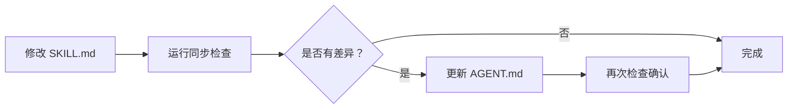

# Skill 与 Agent 内容同步指南

## 目录结构

```
./
├── skills/                    # Skill 定义目录
│   ├── project-manager/
│   │   └── SKILL.md          # Skill 源文件
│   ├── frontend-design/
│   │   └── SKILL.md
│   └── tech-lead/
│       └── SKILL.md
├── agents/                    # Subagent 配置目录
│   ├── project-manager/
│   │   └── AGENT.md          # Subagent 配置文件
│   ├── frontend-design/
│   │   └── AGENT.md
│   └── tech-lead/
│       └── AGENT.md
└── scripts/
    └── sync-skill-agent.sh    # 同步检查脚本
```

## 为什么需要两个文件？

| 维度 | SKILL.md | AGENT.md |
|------|----------|----------|
| **用途** | 用于 `skill()` 工具调用 | 用于 subagent 自动调用 |
| **上下文** | 共享主会话上下文 | 隔离的独立上下文 |
| **格式** | 完整详细的工作流 | 精简的核心指令 + YAML frontmatter |
| **平台** | OpenCode 专用 | 多平台通用（Opencode/Claude/Gemini） |
| **位置** | `skills/{name}/SKILL.md` | `agents/{name}/AGENT.md` |

## 内容同步原则

### 必须同步的内容
1. **角色定义** - 核心职责描述
2. **输出规范** - 输出路径和格式要求
3. **工作流程** - 主要任务执行步骤
4. **质量检查清单** - 验收标准

### 可以不同的内容
1. **详细程度** - AGENT.md 更精简
2. **示例代码** - SKILL.md 可以包含更多示例
3. **平台特定配置** - YAML frontmatter 不同

## 同步方法

### 方法 1：自动检查（推荐）

运行同步检查脚本：

```bash
# 检查所有 skill
./scripts/sync-skill-agent.sh

# 检查单个 skill
./scripts/sync-skill-agent.sh project-manager
```

### 方法 2：手动同步

当修改了 `skills/{name}/SKILL.md` 后：

1. 打开对应的 `agents/{name}/AGENT.md`
2. 对比以下关键章节：
   - `## 角色定义`
   - `## 输出规范`
   - `## 工作流程`（如有）
   - `## 质量检查清单`
3. 更新 agent 文件中的对应内容
4. 再次运行检查脚本确认

### 方法 3：重新生成

如需完全重新生成 agent 文件：

```bash
# 备份旧文件
cp agents/project-manager/AGENT.md agents/project-manager/AGENT.md.bak

# 手动重新生成
# 1. 读取 SKILL.md
# 2. 提取核心内容
# 3. 填充到 agent 模板
```

## 变更管理流程

### 修改 Skill 时的流程



### Checklist

- [ ] 修改 `skills/{name}/SKILL.md`
- [ ] 运行 `./scripts/sync-skill-agent.sh {name}`
- [ ] 对比差异内容
- [ ] 更新 `agents/{name}/AGENT.md`
- [ ] 再次运行检查确认一致
- [ ] 提交变更（两个文件一起提交）

## 多平台配置差异

### Opencode AI

```markdown
---
description: 描述
mode: subagent
model: claude-sonnet-4-20250514
tools: ["read", "write", "bash"]
---
```

### Claude Code

```markdown
---
# name: agent-name
# kind: local
---
```

### Gemini CLI

```markdown
---
tools: ["*"]
---
```

**注意**：当前 AGENT.md 文件同时包含三种格式注释，实际使用时根据需要启用对应的配置块。

## 常见问题

### Q: 为什么不自动同步？

A: AGENT.md 是精简版，需要人工判断哪些内容需要保留。完全自动同步可能导致 agent 文件过于冗长。

### Q: 可以只使用 SKILL.md 吗？

A: 可以。如果不需要 subagent 功能，可以忽略 `agents/` 目录。

### Q: 应该先修改哪个文件？

A: **始终先修改 SKILL.md**，然后同步到 AGENT.md。SKILL.md 是单一事实来源。

### Q: 如何知道哪些内容不同步？

A: 运行同步检查脚本，它会标记出可能有差异的部分。

## 最佳实践

1. **SKILL.md 是源** - 所有修改从 SKILL.md 开始
2. **定期同步** - 每次修改 Skill 后都检查 AGENT.md
3. **精简优先** - AGENT.md 保持精简，只保留核心指令
4. **版本控制** - 两个文件都提交到 git
5. **测试验证** - 修改后测试 subagent 是否正常工作

---

**最后更新**: 2026-03-19
**维护者**: 项目团队
