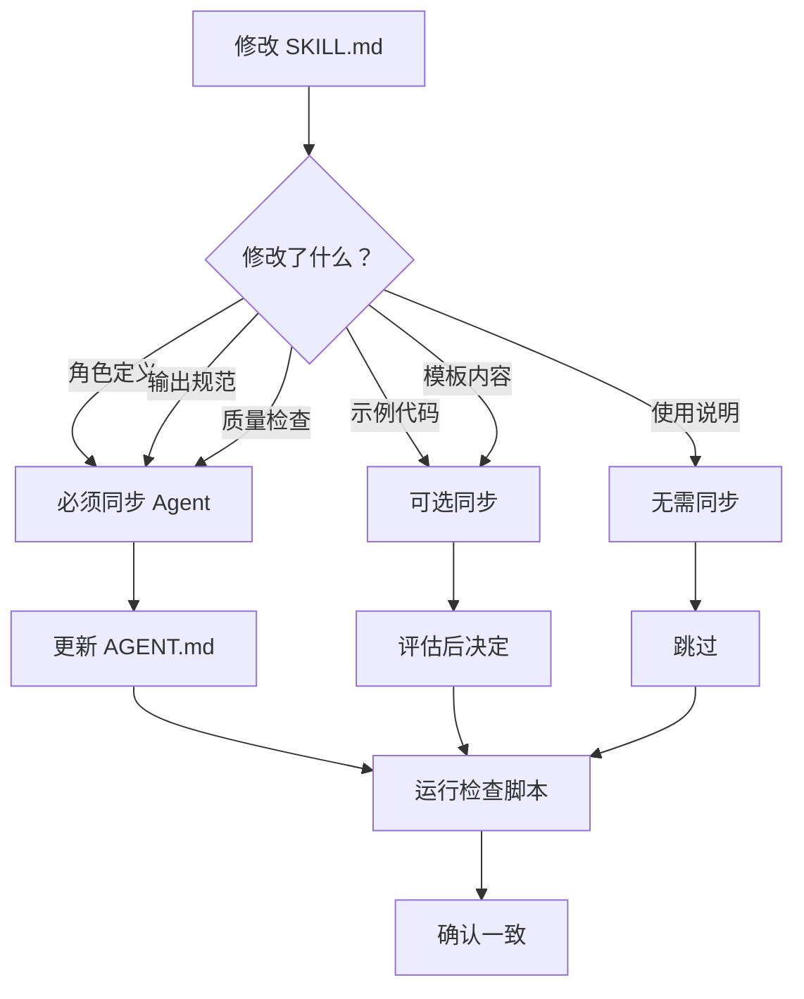

# Skill vs Agent 内容对比

## 内容映射关系

### project-manager

| 章节 | SKILL.md | AGENT.md | 说明 |
|------|----------|----------|------|
| 角色定义 | ✓ 完整 | ✓ 精简版 | Agent 保留核心职责 |
| 输出规范 | ✓ 详细 | ✓ 简化 | 保留路径规范 |
| 工作流程 | ✓ 3 个模板 | ✓ 3 个流程 | Agent 简化描述 |
| 常用模板 | ✓ 详细示例 | - | Agent 不包含 |
| 质量检查 | ✓ 7 项 | ✓ 7 项 | 保持一致 |

### frontend-design

| 章节 | SKILL.md | AGENT.md | 说明 |
|------|----------|----------|------|
| 角色定义 | ✓ 完整 | ✓ 精简版 | Agent 保留核心职责 |
| 技术栈 | ✓ 详细列表 | ✓ 简化列表 | 保留关键技术 |
| 设计原则 | ✓ 5 项详细 | ✓ 4 项简化 | 保留核心原则 |
| 三轮澄清 | ✓ 详细问题 | ✓ 简化问题 | 保留框架 |
| 输出规范 | ✓ 详细 | ✓ 简化 | 保留路径规范 |
| 质量检查 | ✓ 多维度 | ✓ 多维度 | 保持一致 |

### tech-lead

| 章节 | SKILL.md | AGENT.md | 说明 |
|------|----------|----------|------|
| 角色定义 | ✓ 完整 | ✓ 精简版 | Agent 保留核心职责 |
| 三轮澄清 | ✓ 详细模板 | ✓ 简化模板 | 保留框架 |
| 输出规范 | ✓ 详细 | ✓ 简化 | 保留路径规范 |
| 设计评估 | ✓ 详细 | ✓ 简化 | 保留检查项 |
| 质量检查 | ✓ 多维度 | ✓ 多维度 | 保持一致 |

## 差异说明

### AGENT.md 精简的内容

1. **示例代码** - Agent 不包含详细的示例模板
2. **Mermaid 图表** - 复杂的流程图在 Agent 中简化
3. **使用说明** - 详细的使用指南在 Agent 中省略
4. **平台差异** - Skill 包含更多 OpenCode 特定说明

### AGENT.md 特有的内容

1. **YAML Frontmatter** - 多平台配置（Opencode/Claude/Gemini）
2. **平台兼容性注释** - 三种平台的配置格式

## 同步优先级

### 必须同步（高优先级）

- ✅ 角色定义（核心职责）
- ✅ 输出路径规范
- ✅ 质量检查清单
- ✅ 工作流程框架

### 可选同步（中优先级）

- ⚠️ 详细示例代码
- ⚠️ 模板的具体内容
- ⚠️ 使用说明

### 不同步（低优先级）

- ❌ Mermaid 流程图
- ❌ 复杂的表格
- ❌ 平台特定的工具调用示例

## 变更影响评估

### 修改 SKILL.md 后的评估流程

### 快速评估表

| 修改内容 | 同步操作 | 紧急度 |
|----------|----------|--------|
| 角色定义变化 | 立即同步 | 🔴 高 |
| 输出路径变化 | 立即同步 | 🔴 高 |
| 检查清单变化 | 立即同步 | 🔴 高 |
| 工作流程变化 | 同步框架 | 🟡 中 |
| 示例代码变化 | 可选同步 | 🟡 中 |
| 文档说明变化 | 无需同步 | 🟢 低 |

## 版本对应关系

| Skill 版本 | Agent 版本 | 同步日期 |
|-----------|------------|----------|
| v1.0 | v1.0-lite | 2026-03-19 |

**注意**：Agent 版本号保持一致，添加 `-lite` 后缀表示精简版。

---

**维护提示**：每次修改 SKILL.md 后，请更新此表格的版本对应关系。
