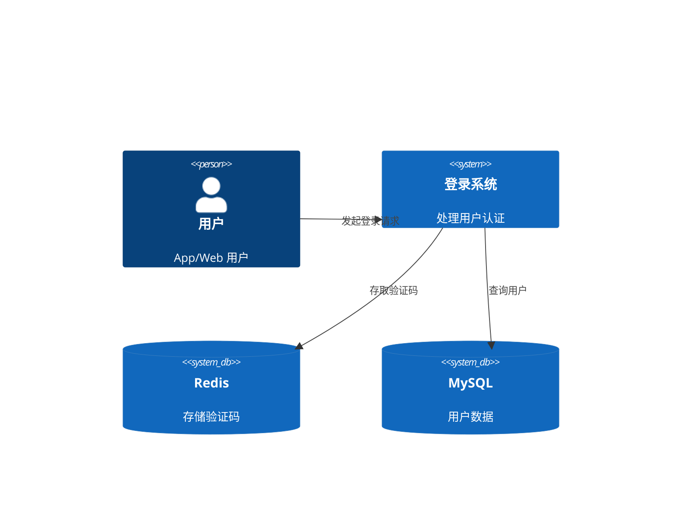

# Tech Lead Skill - 技术方案输出示例

## 输入

PRD: docs/prd/mobile-login.md
团队技术栈：Node.js, NestJS, TypeScript, MySQL, Redis

## AI 输出示例

```markdown
---
id: TECH-2024-001
prid: PRD-2024-001
author: @team
review-date: 2024-01-16
status: approved
---

# 技术方案：手机号登录功能

## 架构设计



## 技术选型

| 方案 | 阿里云 SMS | 腾讯云 SMS |
|------|-----------|-----------|
| 到达率 | 99% | 98% |
| 价格 | 0.045 元/条 | 0.048 元/条 |
| 推荐度 | ✅ | 备选 |

## API 设计

| 方法 | 路径 | 描述 |
|------|------|------|
| POST | /api/v1/auth/send-code | 发送验证码 |
| POST | /api/v1/auth/login | 登录 |
```

## 质量检查清单

- [ ] 架构图清晰
- [ ] 技术选型有对比
- [ ] API 设计符合 RESTful
